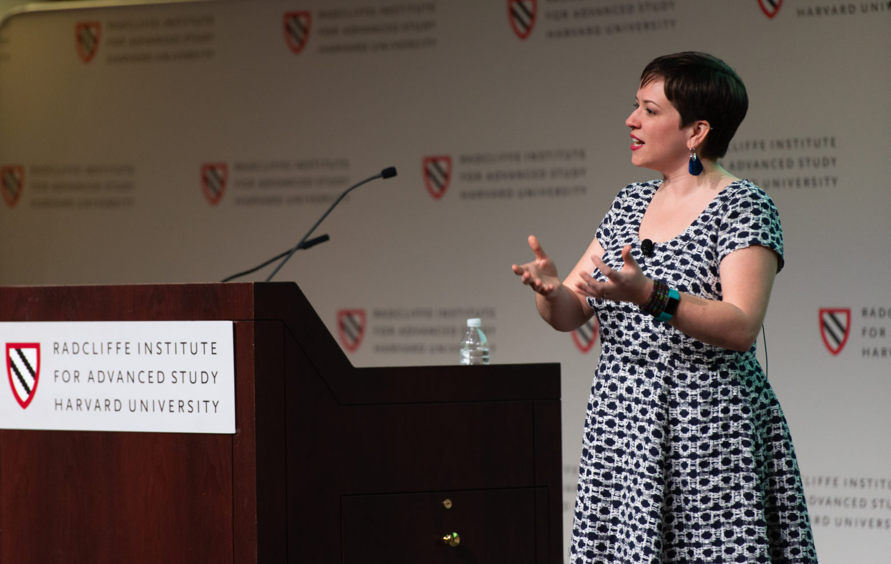

layout: page
title: "Biography"
permalink: /bio/

I am an Associate Professor in the [Department of Medical History and Bioethics](https://medhist.wisc.edu/) at the University of Wisconsin–Madison. I’m also a member of the [History of Science, Medicine, and Technology (HSMT) program](https://history.wisc.edu/fields-programs-and-working-groups/history-of-science-medicine-and-technology/) in the Department of History, and a member of the Steering Committee for the [Holtz Center for Science and Technology Studies](https://sts.wisc.edu/).

I completed my PhD in Cornell’s [Department of Science and Technology Studies](http://sts.cornell.edu/), and was a postdoctoral research fellow in the [Social Studies of Medicine department](https://www.mcgill.ca/ssom/social-studies-medicine) at McGill University. In 2018/2019, I was a fellow in residence at the [Radcliffe Institute for Advanced Study](https://www.radcliffe.harvard.edu/) at Harvard University.

At UW–Madison, I direct the [Health and the Humanities](http://guide.wisc.edu/undergraduate/letters-science/english/health-humanities-certificate/) undergraduate certificate program, and teach courses in science and technology studies, biology and society, and history of science. I have won numerous awards for my undergraduate teaching, including the Dorothy and Hsin-Nung Yao Award for Excellence in Undergraduate Teaching from the Department of History.

I am Editor for the journal [Social Studies of Science](http://journals.sagepub.com/home/sss/), where I manage the review process and make decisions on a subset of manuscripts submitted to the journal. I’m also on the editorial board for the journal [New Genetics and Society](http://www.tandfonline.com/toc/cngs20/current), the [Journal of the History of Biology](https://link.springer.com/journal/10739), and was the reviews editor at Social Studies of Science.

For more about me, you can download my CV or read my [Quick Study profile in the Radcliffe Magazine](https://www.radcliffe.harvard.edu/news/radcliffe-magazine/quick-study-nicole-c-nelson).