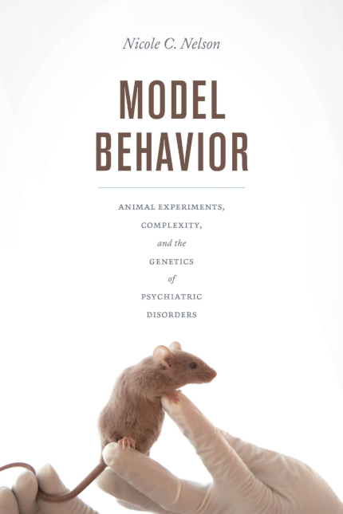

Purchase my book from [Amazon](https://amzn.to/48WNmsA) or [Chicago University Press](https://press.uchicago.edu/ucp/books/book/chicago/M/bo27949249.html)

  

    
1.

Lubega N, Anderson A, Nelson NC. Experience of irreproducibility as a risk factor for poor mental health in biomedical science doctoral students: A survey and interview-based study. Forero DA, ed. <i>PLoS ONE</i>. 2023;18(11):e0293584. doi:<a href="https://doi.org/10.1371/journal.pone.0293584">10.1371/journal.pone.0293584</a>

  

  
  

    
2.

Nelson NC, Timmermans S, Warwick A, Konopásek Z, Vance RE, Kuo WH. On first reading Bruno Latour. <i>Soc Stud Sci</i>. 2023;53(2):174-179. doi:<a href="https://doi.org/10.1177/03063127231158086">10.1177/03063127231158086</a>

  

  
  

    
3.

Nelson NC, Chung J, Ichikawa K, Malik MM. Psychology Exceptionalism and the Multiple Discovery of the Replication Crisis. <i>Review of General Psychology</i>. 2022;26(2):184-198. doi:<a href="https://doi.org/10.1177/10892680211046508">10.1177/10892680211046508</a>

  

  
  

    
4.

Nelson NC, Ichikawa K, Chung J, Malik MM. Mapping the discursive dimensions of the reproducibility crisis: A mixed methods analysis. <i>PLoS ONE</i>. 2021;16(7):e0254090. doi:<a href="https://doi.org/10.1371/journal.pone.0254090">10.1371/journal.pone.0254090</a>

  

  
  

    
5.

Nelson NC. Understand the real reasons reproducibility reform fails. <i>Nature</i>. 2021;600(7888):191-191. doi:<a href="https://doi.org/10.1038/d41586-021-03617-w">10.1038/d41586-021-03617-w</a>

  

  
  

    
6.

Nelson N. Towards an expanded conception of publication bias. <i>Journal of Trial &amp; Error</i>. 2020;1(1). doi:<a href="https://doi.org/10.36850/mr2">10.36850/mr2</a>

  

  
  

    
7.

Nelson NC. <i>Model Behavior: Animal Experiments, Complexity, and the Genetics of Psychiatric Disorders</i>. University of Chicago Press; 2018.

  

  
  

    
8.

Cambrosio A, Vignola-Gagné E, Nelson N, Keating P, Bourret P. Genomic platforms and clinical research. In: Gibbon, Sarah, Prainsack, Barbara, Hilgartner, Steven, Lamoreaux, Janelle, eds. <i>Handbook of Genomics, Health and Society</i>. Routledge; 2018:142-150.

  

  
  

    
9.

Cambrosio A, Bourret P, Keating P, Nelson N. Opening the Regulatory Black Box of Clinical Cancer Research: Transnational Expertise Networks and “Disruptive” Technologies. <i>Minerva</i>. 2017;55(2):161-185. doi:<a href="https://doi.org/10.1007/s11024-017-9324-2">10.1007/s11024-017-9324-2</a>

  

  
  

    
10.

Davies GF, Greenhough BJ, Hobson-West P, et al. Developing a Collaborative Agenda for Humanities and Social Scientific Research on Laboratory Animal Science and Welfare. Olsson IAS, ed. <i>PLoS ONE</i>. 2016;11(7):e0158791. doi:<a href="https://doi.org/10.1371/journal.pone.0158791">10.1371/journal.pone.0158791</a>

  

  
  

    
11.

Nelson N. Model homes for model organisms: Intersections of animal welfare and behavioral neuroscience around the environment of the laboratory mouse. <i>BioSocieties</i>. 2016;11(1):46-66. doi:<a href="https://doi.org/10.1057/biosoc.2015.19">10.1057/biosoc.2015.19</a>

  

  
  

    
12.

Keating P, Cambrosio A, Nelson NC. “Triple negative breast cancer”: Translational research and the (re)assembling of diseases in post-genomic medicine. <i>Studies in History and Philosophy of Science Part C: Studies in History and Philosophy of Biological and Biomedical Sciences</i>. 2016;59:20-34. doi:<a href="https://doi.org/10.1016/j.shpsc.2016.05.003">10.1016/j.shpsc.2016.05.003</a>

  

  
  

    
13.

Nelson NC. A Knockout Experiment: Disciplinary Divides and Experimental Skill in Animal Behaviour Genetics. <i>Med Hist</i>. 2015;59(3):465-485. doi:<a href="https://doi.org/10.1017/mdh.2015.30">10.1017/mdh.2015.30</a>

  

  
  

    
14.

Cambrosio A, Keating P, Nelson N. Régimes thérapeutiques et dispositifs de preuve en oncologie : l’organisation des essais cliniques, des groupes coopérateurs aux consortiums de recherche. <i>Sciences Sociales et Santé</i>. 2014;32(3):13-42. doi:<a href="https://doi.org/10.1684/sss.2014.0302">10.1684/sss.2014.0302</a>

  

  
  

    
15.

Ankeny RA, Leonelli S, Nelson NC, Ramsden E. Making Organisms Model Human Behavior: Situated Models in North-American Alcohol Research, since 1950. <i>Sci Context</i>. 2014;27(3):485-509. doi:<a href="https://doi.org/10.1017/S0269889714000155">10.1017/S0269889714000155</a>

  

  
  

    
16.

Nelson NC, Keating P, Cambrosio A, Aguilar-Mahecha A, Basik M. Testing devices or experimental systems? Cancer clinical trials take the genomic turn. <i>Social Science &amp; Medicine</i>. 2014;111:74-83. doi:<a href="https://doi.org/10.1016/j.socscimed.2014.04.008">10.1016/j.socscimed.2014.04.008</a>

  

  
  

    
17.

Nelson NC, Keating P, Cambrosio A. On being “actionable”: clinical sequencing and the emerging contours of a regime of genomic medicine in oncology. <i>New Genetics and Society</i>. 2013;32(4):405-428. doi:<a href="https://doi.org/10.1080/14636778.2013.852010">10.1080/14636778.2013.852010</a>

  

  
  

    
18.

Nelson NC. Modeling mouse, human, and discipline: Epistemic scaffolds in animal behavior genetics. <i>Soc Stud Sci</i>. 2013;43(1):3-29. doi:<a href="https://doi.org/10.1177/0306312712463815">10.1177/0306312712463815</a>

  

  
  

    
19.

Keating P, Cambrosio A, Nelson NC, Mogoutov A, Cointet JP. Therapy’s Shadow: A Short History of the Study of Resistance to Cancer Chemotherapy. <i>Front Pharmacol</i>. 2013;4. doi:<a href="https://doi.org/10.3389/fphar.2013.00058">10.3389/fphar.2013.00058</a>

  

  
  

    
20.

Nelson N. Shooting Genes, Distributing Credit: Narrating the Development of the Biolistic Gene Gun. <i>Science as Culture</i>. 2012;21(2):205-232. doi:<a href="https://doi.org/10.1080/09505431.2011.614335">10.1080/09505431.2011.614335</a>

  

  
  

    
21.

Nelson N. <i>Capturing Complexity: Experimental Systems and Epistemic Scaffolds in Animal Behavior Genetics</i>. Doctoral Dissertation. Cornell University; 2011.

  

  
  

    
22.

Nelson N, Geltzer A, Hilgartner S. Introduction: the anticipatory state: making policy-relevant knowledge about the future. <i>Sci and Pub Pol</i>. 2008;35(8):546-550. doi:<a href="https://doi.org/10.3152/030234208X370648">10.3152/030234208X370648</a>

  

  

